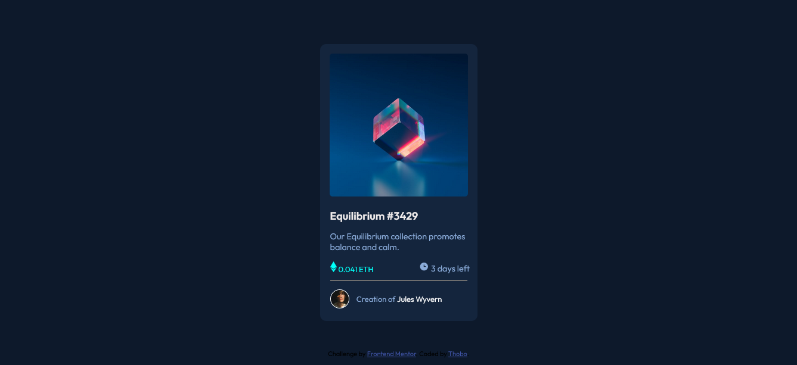
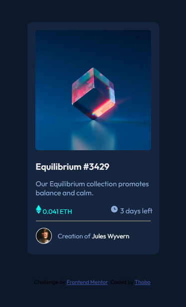

# Frontend Mentor - NFT preview card component solution

This is a solution to the [NFT preview card component challenge on Frontend Mentor](https://www.frontendmentor.io/challenges/nft-preview-card-component-SbdUL_w0U). Frontend Mentor challenges help you improve your coding skills by building realistic projects. 

## Table of contents

- [Overview](#overview)
  - [The challenge](#the-challenge)
  - [Screenshot](#screenshot)
  - [Links](#links)
- [My process](#my-process)
  - [Built with](#built-with)
  - [Useful resources](#useful-resources)
- [Author](#author)

## Overview

### The challenge

Users should be able to:

- View the optimal layout depending on their device's screen size
- See hover states for interactive elements

### Screenshot

### Links

- Solution URL: [nft-preview-component-main](https://github.com/Thobo-Gaboipewe/nft-preview-card-component-main)
- Live Site URL: [nft-preview-component-thobo](https://nft-preview-component-thobo.netlify.app/)

## My process

### Built with

- Flexbox
- CSS Grid

### Useful resources

- [Mozilla Developer Network](https://www.example.com) - I really liked this website and will use it going forward.

## Author

- Frontend Mentor - [@ThoboGaboipewe](https://www.frontendmentor.io/profile/yourusername)